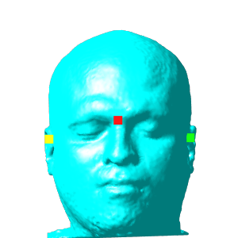
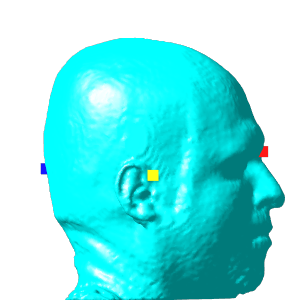
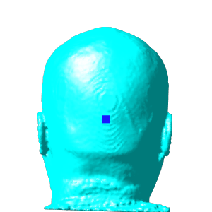
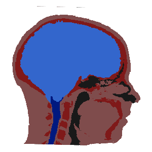

# Experiments with Predicting Landmarks in 3D MRI

As a little side project I wanted to predict four landmarks used to identify the EEG 10-10 system points.
These four points include

- Nasion (Nz)
- Inion (Iz)
- Left Pre-Auricular point (LPA)
- Right Pre-Auricular point (RPA)

These points are visualized below: Nz (red), Iz (blue), LPA (green), and RPA (yellow).

|                   front                   |                  left                   |                  back                   |
| :---------------------------------------: | :-------------------------------------: | :-------------------------------------: |
|  |  |  |

## Create Training Data

To create training data for this experiment I annotated 3 _template_ datasets. Using our automatic head segmentation tool (head40), I segmented the _template heads_ and 20 subjects from the [Calgary-Campinas](https://sites.google.com/view/calgary-campinas-dataset/home) (CC) dataset. Grouping tissues I obtain simplified head labels:

- brain (including CSF)
- bone
- air
- spinal cord (including CSF)
- other

Using [`SimpleITK`](https://pypi.org/project/SimpleITK/) I registered the _template_ head labels to the CC dataset (affine and B-spline). By design the registration finds transforms that map from the moving (CC) to fixed (_template_) space. To transform the _template_ landmarks to the CC space, we need to use the inverse transform. For each subject I now have 3 candidate positions for each landmark. To increase the accuracy and remove bias I average these three positions to create my training data for a [RetinaNet](https://arxiv.org/abs/1708.02002).

Since I am using a box detector to locate 3D points, I simply create cubic boxes with fixed width (5mm) in `cccwhd` (X,Y,Z centers and width, height and depth).

## Adapt MONAI Tutorial

For this purpose I adapted the [detection tutorial](https://github.com/Project-MONAI/tutorials/tree/main/detection) from [MONAI](https://github.com/Project-MONAI). That tutorial predicts lung nodules from CT images using RetinaNet. The things I needed to modify included

- image normalization: instead of scaling from a fixed range to \[0, 1\] I use a [`NormalizeIntensityd`](https://docs.monai.io/en/stable/transforms.html#normalizeintensityd) transform.
- since I want to learn left-right landmarks, I removed the random flip transforms
- since the input data is MRI, I use different [intensity augmentation](https://docs.monai.io/en/stable/transforms.html#intensity-dict), e.g.,
  - RandAdjustContrastd
  - RandHistogramShiftd
  - RandBiasFieldd
  - RandGibbsNoised
  - RandKSpaceSpikeNoised

Running the training for 300 steps takes 1-2 hours on my GPU (NVIDIA GeForce RTX 3090). I am not yet 100 percent familiar with the COCO metrics, but Recall IoU on the test data seems pretty good (considering the training data was generated automatically and not curated).

| Nz AR IoU | Iz AR IoU | LPA AR IoU | RPA AR IoU |
| :-------: | :-------: | :--------: | :--------: |
|   0.85    |   0.87    |    0.89    |    0.91    |

## Acknowledgement

- Calgary-Campinas [multi-vendor multi-field strength T1w MRI dataset](https://sites.google.com/view/calgary-campinas-dataset/home)
- MONAI [Detection tutorial](https://github.com/Project-MONAI/tutorials/tree/main/detection)
- [SimpleITK](https://simpleitk.org/), with a powerful API for using [ITK](https://itk.org/) from Python
