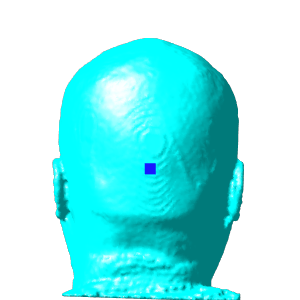

# How to to visualize 3D (detection) boxes

Visualizing box prediction/annotation in 3D medical image detection is not straightforward. To better understand model predictions, we provide a way to further visualize detection results/ground truth using the free and open source software [3D Slicer](https://www.slicer.org/). 3D Slicer enables visualization of 3D images, 3D segmentation masks, and 3D meshes with 3D orthographic views. And we convert 3D box annotations/predictions into meshes that can be visualized by cross-sectional curves in three 2D planes.

## Prerequisite

- Box information should be stored in a ".json" file. The information of *N* boxes is stored under the key "box" as *N* lists. The six values could be in different 3D [modes](https://github.com/Project-MONAI/MONAI/blob/edf3b742a4ae85d1f30462ed0c7511c520fae888/monai/data/box_utils.py#L447-L456) (e.g., corner or center coordinates). All the coordinate values are in either world coordinate system or image coordinate system. The "data_sample.json" file is an example with X/Y/Z-axial center coordinates and box lengths (box mode **cccwhd**).

```
"box": [
    [
        -100.312255859375,
        67.529541015625,
        -231.97265625,
        6.328125,
        6.328125,
        6.4453125
    ],
    [
        -19.013427734375,
        10.576416015625,
        -48.28125,
        5.09765625,
        5.09765625,
        5.3125
    ]
]
```

## Steps

### 1. Create ".obj" file for predictions/annotation using the "save_obj.py" script.

User needs to specify the box mode and whether to use image coordinates. If image coordinates are specified, the image root directory needs to be provided.

#### Example of boxes in world coordinate

```
python save_obj.py  --input_box_mode "cccwhd" \
                    --input_dataset_json ./data_sample.json \
                    --output_dir ./out
```

### 2. Load the original 3D image and the resulting ".obj" file into 3D Slicer or Sim4Life.

Example visualization of landmarks in Sim4Life.

|            Front            |           Left            |           Back            |
| :-------------------------: | :-----------------------: | :-----------------------: |
|  |  |  |
